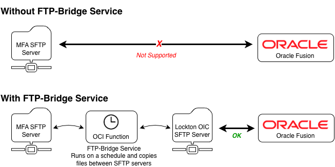

# FTP-Bridge Service

## Purpose

It is not possible to configure a direct connection between Oracle Fusion and HDFC bank as their SFTP server requires a kind of multi-factor authentication (key + passphrase) that is not supported by Oracle nor OIC. The ftp-bridge service has been created to resolve this issue. 



## Architecture

A simple shell script copies files between the ftp servers. The script is called via a container running node and the [Fn serverless functions platform](https://fnproject.io/). The cloud resources are deployed via a [terraform template](./main.tf). The following resources are used:

| Resource      | Purpose |
| ------------- |:-------------:|
| Container Registry & Repository | Used to store the container image |
| Private VCN & Subnet | Secure hosting of OIC Function Service |
| NAT Gateway | Allows ftp-bridge service access to the internet without exposing it  to incoming internet connections |
| Service Gateway | Allows ftp-bridge service access to required OCI services (eg. Container Registry) |
| OCI Function | The ftp-bridge Service itself |

## Building and running your application

### Prepare the Repo

#### Create 'terraform.tfvars' file as follows

``` text
compartment_id  = "<your_compartment_OCID_here>"
region          = "uk-london-1"
```

### Deploy Docker Image

``` shell
docker login lhr.ocir.io
docker build --platform=linux/amd64 -t lhr.ocir.io/[repositoryNamespace]/ftp-bridge:0.1.0 .
docker push lhr.ocir.io/[repositoryNamespace]/ftp-bridge:0.1.0
```

(you may want to move the docker image to correct compartment if this is your first time pushing)
...and then update main.tf

### Deploy Infrastructure

``` shell
oci session authenticate (Then choose - 70, then type DEFAULT)
oci session authenticate (Then choose - 70, then type FTP-BRIDGE-TF)
oci session refresh --profile FTP-BRIDGE-TF     -- to refresh the auth token
terraform apply
```

## Notes & Links

- Tutorial: https://developer.hashicorp.com/terraform/tutorials/oci-get-started
- https://registry.terraform.io/providers/oracle/oci/latest/docs
- https://registry.terraform.io/providers/oracle/oci/latest/docs/resources/functions_function
- To list compartments: `oci iam compartment list --config-file /Users/[your username]]/.oci/config --profile DEFAULT --auth security_token --compartment-id-in-subtree true`
- To manually invoke the function: `fn invoke ftp-bridge-application ftp-bridge-function`