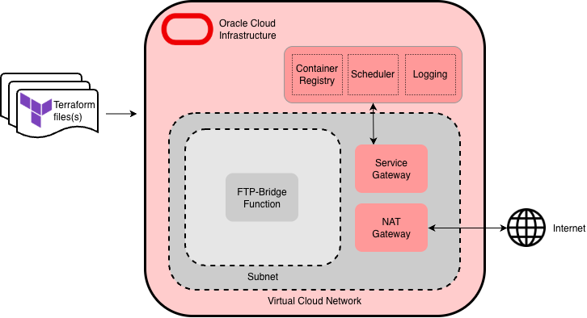

# FTP-Bridge Service

## Purpose

It is not possible to configure a direct connection between Oracle Fusion and HDFC bank as their SFTP server requires a kind of multi-factor authentication (key + passphrase) that is not supported by Oracle nor OIC. The ftp-bridge service has been created to resolve this issue. 


## Architecture



A simple [shell script](./ftp-bridge.sh) copies files between the ftp servers. The script is called via a container running node and the [Fn serverless functions platform](https://fnproject.io/). The cloud resources are deployed via a [terraform template](./main.tf). The following resources are used:

| Resource      | Purpose |
| ------------- |:-------------:|
| [Container Registry & Repository](https://docs.oracle.com/en-us/iaas/Content/Registry/Concepts/registryoverview.htm) | Used to store the container image |
| [Private VCN & Subnet](https://docs.oracle.com/en-us/iaas/Content/Network/Concepts/overview.htm) | Secure hosting of OIC Function Service |
| [NAT Gateway](https://docs.oracle.com/en-us/iaas/Content/Network/Tasks/NATgateway.htm) | Allows ftp-bridge service access to the internet without exposing it  to incoming internet connections |
| [Service Gateway](https://docs.oracle.com/en-us/iaas/Content/Network/Tasks/servicegateway.htm) | Allows ftp-bridge service access to required OCI services (eg. Container Registry) |
| [OCI Function](https://docs.oracle.com/en-us/iaas/Content/Functions/Concepts/functionsoverview.htm) | The ftp-bridge Service itself (serverless function) |
| [Resource Scheduler](https://docs.oracle.com/en-us/iaas/Content/resource-scheduler/home.htm) | Schedules the ftp-bridge service |
| [Service Log](https://docs.oracle.com/en-us/iaas/Content/Logging/Concepts/loggingoverview.htm) | Logging for the ftp-bridge service |

### Prepare the Repo

#### Create 'terraform.tfvars' file as follows

``` text
compartment_id      = "<your_compartment_OCID_here>"
region              = "uk-london-1"
tenancy_ocid        = "<your_tenancy_id_here>"
logging_group_id    = "<your_logging_group_id_here>"
image_path          = "<docker image path> (see below)"
```

### Deploy Docker Image

``` shell
docker login lhr.ocir.io
docker build --platform=linux/amd64 -t lhr.ocir.io/[repositoryNamespace]/ftp-bridge:0.1.0 .
docker push lhr.ocir.io/[repositoryNamespace]/ftp-bridge:0.1.0
```

(you may want to move the docker image to correct compartment if this is your first time pushing) <br>
Now update the `terraform.tfvars` file with the image path

### Deploy Infrastructure

``` shell
oci session authenticate (then choose 70, then type DEFAULT)
oci session authenticate (then choose 70, then type FTP-BRIDGE-TF)
terraform apply
```

## Notes & Links

- Terraform:
    - https://docs.oracle.com/en-us/iaas/Content/dev/terraform/home.htm
    - https://developer.hashicorp.com/terraform/tutorials/oci-get-started
    - https://docs.oracle.com/en-us/iaas/Content/dev/terraform/tutorials/tf-simple-infrastructure.htm
    - https://registry.terraform.io/providers/oracle/oci/latest/docs
    - https://docs.oracle.com/en/cloud/foundation/iac/index.html#deployment-architectures
- OCI CLI, Functions & Docker:
    - https://developer.hashicorp.com/terraform/tutorials/oci-get-started/oci-build
    - https://docs.oracle.com/en-us/iaas/Content/Functions/home.htm
    - https://fnproject.io/tutorials/node/intro/
    - https://docs.docker.com/get-started/
- To list compartments: `oci iam compartment list --config-file /Users/[your username]]/.oci/config --profile DEFAULT --auth security_token --compartment-id-in-subtree true`
- To refresh OCI auth token: `oci session refresh --profile FTP-BRIDGE-TF`
- To manually invoke the function: `fn invoke ftp-bridge-application ftp-bridge-function`
